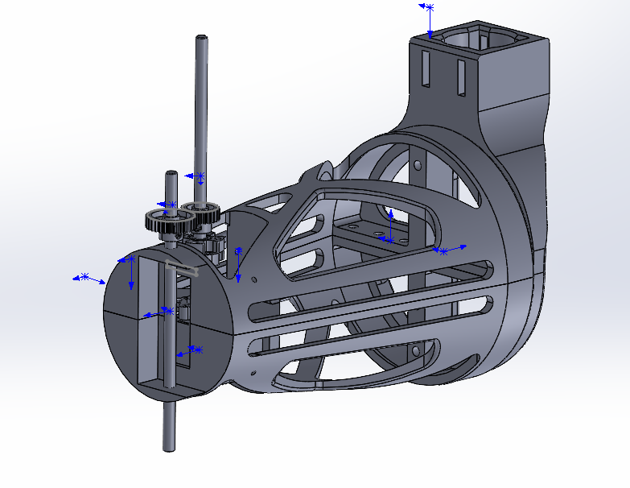

# ARMUS Mecanics
## BOM
The quantity of each part is indicated between parenthesis

### Wrist

3d printed parts :
- ARMUS-500-001 (x1)
- ARMUS-500-003 (x1)
- XL430-W250-T (x2)
- HN11-I101 set (x1)
- M2 x 0.4 x 6 Flat Head Countersunk Screw (x12)
- M2.5 x 0.44 x 6 Flat Head Countersunk Screw (x12)

### Forearm

3d printed parts :
- ARMUS-400-000 (x1)

### Elbow

- XM430-W350-T (x1)
- D-Shaft 1.25x6 (x2)
- Hub 0.25 (x1)
- Bore Set Screw D hub (x1)
- 24T 6mm Bore 32P Shaft Mount Pinion Gear (x1)
- 32T 1/4” Bore 32P Shaft Mount Pinion Gear (x1)

### Upper Arm

3d printed parts :
- ARMUS-203-001 (x1)
- ARMUS-203-002 (x1)
- ARMUS-203-003 (x1)
-------------------------------------------
## SolidWorks Nomenclature
 ARMUS-000-000 --> [Principal assembly](#principal-assembly)   
 ARMUS-100-000 --> [Shoulder assembly](#shoulder-assembly)      
 ARMUS-200-000 --> [Upper Arm assembly](#upper-arm-assembly)   
 ARMUS-300-000 --> [Elbow assembly (merged to Upper Arm)](#elbow-assembly)     
 ARMUS-400-000 --> [Forearm assembly](#forearm-assembly)     
 ARMUS-500-000 --> [Wrist assembly](#wrist-assembly)      
 ***In assembly files , each piece that starts by the name ARMUS is a piece that was designed by the team ARMUS and needs to be 3D printed in PLA(Infill specified in each assembly) for the Assembly(other pieces are from other 
suppliers)***    

## Principal Assembly
    
The full assembly of the arm consists of 3 parts: the Shoulder, the Upper Arm and the wrist. Each of those parts are assembled separately before doing the final assembly.  
   

## Shoulder assembly
    
The shoulder is the main part of Armus. Most of the work is done by this part. The first thing to assemble should be the acrylic base with the shafts support. After that, bolt the two motor supports to the main support.
Afterwards, put the motor on the supports and plug the shaft to them along with the 14 teeth gear. The next step is to place the long shaft with the two big gears and the little box to put the bolt passing through the bevel gear. Afterwards, put the bevel gear between the two main gears and tighten with a bolt that goes through the little box in the middle of the shaft.  
***PLA infill 15%-20%***      
        

## Upper Arm assembly
   
The Main three parts to assemble are the two parts of the humerus and the L part(the L part is the part that will be linked to the shoulder in the final assembly). Afterwards, you can mount the motor inside the humerus with the shaft and pass it through the shaft support. Finally, put the 16 teeth gear on the shaft.    
***PLA infill 10%-15%***      
    

## Elbow assembly 
       
For the elbow joint you can take a 6 inch shaft and pass is through the forearm and the humerus and add a gear on it.  
    

## Forearm assembly
     
The forearm will be plugged on the elbow joint and the wrist will be put inside the motor container of the forarm.  
***PLA infill 5%-10%*** 
## Wrist assembly
   
The Wrist contains two motors. You can start by screwing the hand support to the first motor (We will name it number 1). Afterwards, screw the second motor(We will name it number2) underneath the motor number 1's support. Next you can bolt the motor number 1 inside its support.  
***PLA infill 5%-10%***           
    

